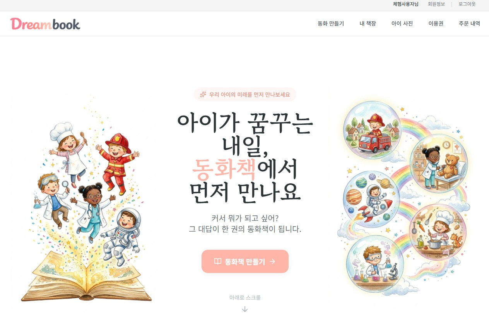
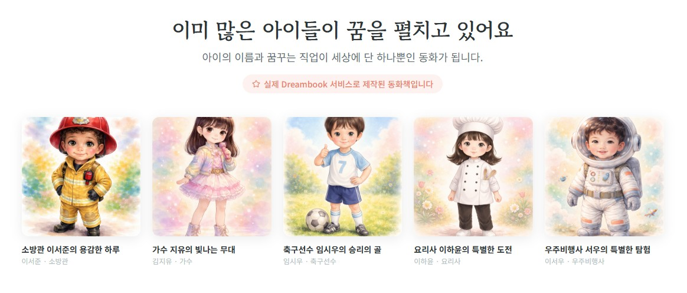
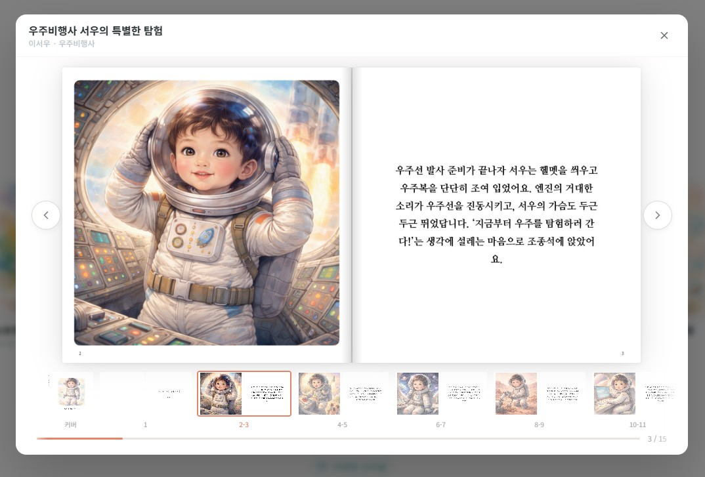
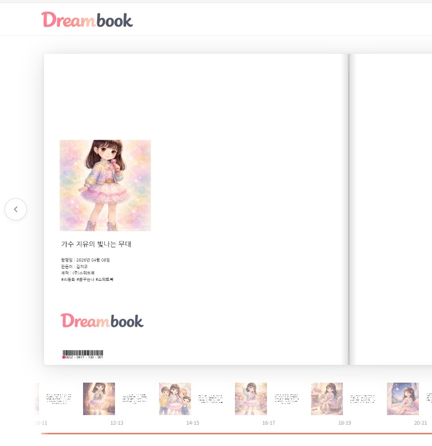
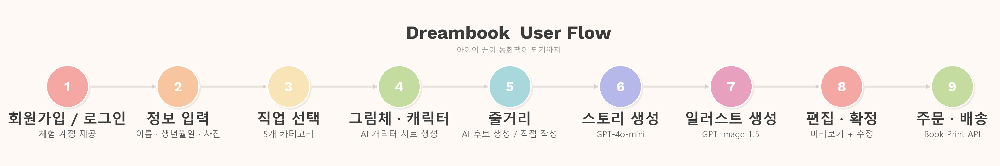

# Dreambook — AI 직업 동화책 서비스

> 우리 아이가 꿈꾸는 직업의 주인공이 되는, 세상에 하나뿐인 AI 동화책.
> 아이의 이름, 사진, 직업을 입력하면 AI가 아이를 닮은 캐릭터와 맞춤 동화를 만들고, 실물 책으로 인쇄·배송해드립니다.

## 타겟 고객

- **부모**: 3~10세 자녀에게 "세상에 하나뿐인 동화책"을 선물하고 싶은 분
- **교육기관**: 유치원·어린이집 졸업 시즌, 장래희망 프로젝트로 원생 전체 동화책 단체 제작

## 주요 기능

- 6단계 위자드로 동화책 완성 (정보 입력 → 직업 선택 → 그림체·캐릭터 → 줄거리 → 스토리 → 일러스트)
- 아이 사진 기반 AI 캐릭터 시트 생성 (그림체 5종, 재생성 가능)
- AI 동화 스토리 11편 + 일러스트 11장 + 표지 자동 생성
- 생성된 스토리와 제목을 직접 수정 가능
- 인쇄 규격(243×248mm) 기반 미리보기
- Book Print API 연동으로 하드커버 동화책 인쇄·배송 주문
- 완성된 동화책 디지털 뷰어 열람
- 실제 제작된 샘플 동화책 5권 즉시 열람 가능

---

## 서비스 화면

<table>
<tr>
<td width="50%"><strong>메인 페이지</strong></td>
<td width="50%"><strong>샘플 동화책 — 실제 서비스로 제작된 5권 열람</strong></td>
</tr>
<tr>
<td></td>
<td></td>
</tr>
<tr>
<td width="50%"><strong>동화책 뷰어 — Book Print API 렌더링 결과 그대로 표시</strong></td>
<td width="50%"><strong>발행면 — 직접 제작한 커스텀 템플릿으로 인쇄될 모습 확인</strong></td>
</tr>
<tr>
<td></td>
<td></td>
</tr>
</table>

### 사용자 워크플로우



---

## 실행 방법

### 사전 준비

- Python 3.10 권장
- Node.js 18+
- [api.sweetbook.com](https://api.sweetbook.com) 가입 후 Sandbox API Key 발급
- [platform.openai.com](https://platform.openai.com) 에서 OpenAI API Key 발급

### 설치 및 실행

```bash
# 저장소 클론
git clone https://github.com/EHW99/dreambook.git
cd dreambook

# 백엔드
cd backend
pip install -r requirements.txt
cp .env.example .env          # Windows: copy .env.example .env
# .env 파일에 API Key 입력:
#   BOOKPRINT_API_KEY=발급받은_Sandbox_Key
#   OPENAI_API_KEY=발급받은_OpenAI_Key
#   SECRET_KEY=임의의_긴_문자열
uvicorn app.main:app --host 0.0.0.0 --port 8000

# 프론트엔드 (새 터미널)
cd ../frontend
npm install
npm run dev
```

### 접속

- 서비스: http://localhost:3000
- API 문서: http://localhost:8000/docs

### 더미 데이터

서버 시작 시 테스트 계정과 샘플 데이터가 자동으로 세팅됩니다.

- **로그인 화면의 "체험 계정으로 로그인" 버튼을 클릭하면 별도 입력 없이 바로 로그인됩니다**
- 메인 페이지에서 샘플 동화책 5권을 바로 열람할 수 있습니다 **(Dreambook 서비스로 직접 제작한 결과물입니다)**
- 마이페이지 > 사진 관리에 샘플 아이 사진이 등록되어 있어 바로 동화책 만들기를 시작할 수 있습니다

---

## 사용한 Book Print API

| API | 용도 |
|-----|------|
| `GET /book-specs` | 판형 목록 조회 |
| `POST /books` | 동화책 생성 |
| `GET /books/{bookUid}` | 책 상태 조회 |
| `DELETE /books/{bookUid}` | 책 삭제 |
| `POST /books/{bookUid}/photos` | 일러스트 이미지 업로드 |
| `POST /books/{bookUid}/cover` | 표지 생성 |
| `POST /books/{bookUid}/contents` | 내지 삽입 (간지, 그림, 스토리, 발행면) |
| `POST /books/{bookUid}/finalization` | 책 최종화 |
| `GET /templates` | 템플릿 목록 조회 |
| `GET /templates/{templateUid}` | 템플릿 상세 조회 |
| `POST /orders/estimate` | 인쇄 견적 조회 |
| `POST /orders` | 주문 생성 |
| `POST /orders/{orderUid}/cancel` | 주문 취소 |
| `PATCH /orders/{orderUid}/shipping` | 배송지 변경 |
| `GET /credits` | 충전금 잔액 조회 |
| `POST /credits/sandbox/charge` | 테스트 충전금 충전 |
| `PUT /webhooks/config` | 웹훅 등록 |
| `POST /webhooks/test` | 테스트 웹훅 전송 |
| `POST /render/page-thumbnail` | 페이지 썸네일 렌더링 |
| `GET /render/thumbnail/{bookUid}/{page}.jpg` | 썸네일 다운로드 |

### 책 조립 워크플로우

```
충전금 확인 → 책 생성 → 사진 업로드 → 표지 생성 → 내지 삽입(×24p) → 최종화 → 견적 조회 → 주문
```

---

## AI 도구 사용 내역

| AI 도구 | 활용 내용 |
|--------|----------|
| Claude Code (claude-opus-4-6) | 프로젝트 설계, 프론트엔드·백엔드 구현, Book Print API 연동, 코드 리뷰 |
| OpenAI GPT-4o-mini | 동화 스토리 생성, 줄거리 후보 생성 |
| OpenAI GPT Image (gpt-image-1.5) | 캐릭터 시트 생성, 페이지 일러스트 생성, 표지 이미지 생성 |
| ChatGPT (이미지 생성) | 로고, 사이트 아이콘 제작 |
| Google Gemini | 온보딩 페이지 소개 이미지 제작 |

---

## 설계 의도

### 왜 이 서비스를 만들었나

스위트북 홈페이지와 AI 스토리교실을 직접 사용해보며 서비스를 파악한 결과, 기존 서비스들이 추억·기념·가족애와 밀접하다는 걸 알 수 있었습니다. 주제를 가족 관련으로 좁힌 뒤, 사진 앨범이나 포토북도 고민했지만 실물 사진에 AI를 섞는 건 피하기로 했습니다. 추억은 추억 그대로 남겨야 한다고 생각했고, 대신 AI가 가장 잘할 수 있는 영역인 이야기를 만들고 상상을 그림으로 그리는 것에 집중하기로 했습니다.

최종 결과물이 디지털 콘텐츠가 아닌 실물 책이라는 점에서, 소장 가치가 있는 주제여야 했습니다. "아이의 꿈"이라는 키워드가 여기서 나왔습니다. 아이 사진 기반 캐릭터가 꿈꾸는 직업의 주인공이 되는 동화책은 부모에게는 선물 동기가 명확하고, 아이에게는 꿈을 구체적으로 상상할 수 있는 경험이 됩니다.

### 비즈니스 가능성

- **명확한 구매 동기**: 부모는 아이를 위한 소비에 적극적이며, "세상에 하나뿐인 책"이라는 감성적 가치가 구매를 유도합니다.
- **B2B 단체 주문**: 유치원·어린이집 졸업 시즌에 원생 전체의 장래희망 동화책을 단체 제작하면, 건당 단가는 낮아지고 주문 규모는 수십~수백 권으로 커집니다.
- **낮은 한계 비용**: AI 생성 비용은 권당 수백 원 수준이며, 인쇄·배송은 Book Print API가 처리하므로 재고 부담이 없습니다.

### 더 시간이 있었다면

- 직업을 잘 모르는 아이를 위한 AI 챗봇 직업 추천 (대화를 통해 아이의 관심사를 파악하고 어울리는 직업을 제안)
- 책 편집기 자유도 향상 (사진 위치·크기 드래그 조정, 텍스트 배치 커스터마이징 등 사용자가 원하는 레이아웃으로 편집)

---

## 기술 스택

| 영역 | 기술 |
|------|------|
| 프론트엔드 | Next.js 14 (App Router), Tailwind CSS, Framer Motion |
| 백엔드 | FastAPI, SQLAlchemy, SQLite |
| AI (텍스트) | OpenAI GPT-4o-mini |
| AI (이미지) | OpenAI GPT Image (gpt-image-1.5, images.edit) |
| 인증 | JWT + bcrypt |
| 책 인쇄 | Book Print API (Sandbox) |

---

## 환경변수

`backend/.env.example` 참고:

| 변수 | 필수 | 설명 |
|------|------|------|
| `BOOKPRINT_API_KEY` | O | Book Print API Sandbox 키 |
| `OPENAI_API_KEY` | O | OpenAI API 키 |
| `SECRET_KEY` | O | JWT 서명용 비밀키 |

---

이 프로젝트는 (주)스위트북 채용 과제 제출용으로 작성되었습니다.
